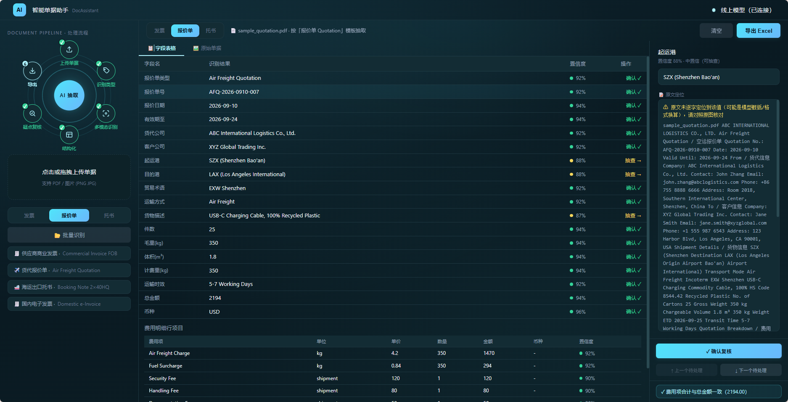
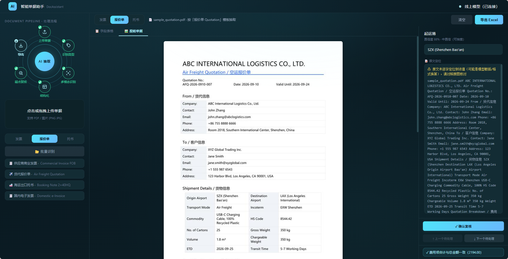

# DocAssistant · 跨境物流单据智能录入助手

上传商业发票 / 货代报价单 / 海运托书（PDF / 扫描件 / 图片），多模态大模型抽取结构化字段，**代码确定性校验**给出置信度，人工只复核低置信字段，勾稽对账通过后导出 TMS 标准 Excel。

> 设计哲学：**大模型管"读得懂"，代码管"信得过"**——识别引擎可替换（耗材），校验体系沉淀复用（资产）。





## 在线演示

**http://47.107.110.4/doc/**

打开后点内置样本按钮（发票 / 报价单 / 托书）即可走完整链路：识别 → 置信度分流 → 人工复核 → 勾稽校验 → Excel 导出。上传真实单据识别约 10–20 秒。

## 核心特性

- **三类单据差异化 Schema**：发票（15 字段·财务口径）/ 报价单（19 字段+费用明细·物流口径）/ 托书（20 字段·物流口径），字段集按下游使用者定义，**Schema 即合同**——模型多吐的字段一律白名单丢弃
- **多模态一体化抽取**：智谱 GLM-4V 读图直出字段（免费档 glm-4v-flash 可跑；Provider 可替换）；未配置 Key 自动降级 Mock 模式，Demo 完整可跑
- **确定性置信度**：格式正则 / 业务字典（币种·贸易术语·箱型·税率档位）/ 数值解析 + **原文回溯定位**——不依赖模型自评
- **三档分流**：≥0.9 预填锁定 ｜ 0.7–0.9 黄色可抽查 ｜ <0.7 标红强制复核（人工只碰该看的）
- **勾稽校验导出闸门**：发票 小计+税额=价税合计、税率×小计≈税额；报价单 费用明细合计=总费用；托书 ETD<ETA、体积≤箱容上限——**不过 = 拦截导出**
- **Excel 导出**：发票横表一行一票（TMS 直接导入）/ 报价单竖排+费用明细 / 批量大表，列序按 Schema 锁死

## 链路

```
上传 PDF / 图片
  ↓ 逐页 200dpi 转图（多页全送模型——报价单费用表常在第 2 页）
GLM-4V 多模态抽取（Schema 合同注入，只输出 JSON）
  ↓ Schema 白名单归一（模型多吐的字段丢弃）
确定性置信度（规则分 + 原文回溯，取大者）
  ↓ 三档分流
人工复核（对照原图 + 原文定位高亮）
  ↓ 勾稽校验（数字对不上 = 拦截导出）
Excel 导出
```

## 快速开始

### 后端（:8540）

```bash
cd api
python -m venv .venv
.venv\Scripts\activate        # Windows；macOS/Linux 为 source .venv/bin/activate
pip install -r requirements.txt
copy .env.example .env        # macOS/Linux: cp；填 ZHIPU_API_KEY，留空则 Mock 模式
uvicorn server:app --port 8540 --reload
```

### 前端（:5175）

```bash
cd web
npm install
npm run dev
```

打开 http://localhost:5175 —— 点内置样本按钮即可体验完整链路（识别 → 置信度分流 → 复核 → 勾稽 → 导出）。

## 目录结构

```
api/        FastAPI 后端
  schemas/    三类单据字段合同（JSON 外置，新增类型 = 加一份 JSON）
  confidence.py   确定性置信度（规则分 + 原文回溯）
  zhipu_client.py VLM 调用（Provider 适配层）
  exporters.py    Excel 导出（横表 / 竖排 / 批量）
  server.py       路由与上传处理
web/        React + Vite 前端
samples/    演示样本（发票 / 报价单 / 托书）
scripts/    样本生成 / 缓存预热 / 诊断与测试脚本
```

## 环境变量

见 `api/.env.example`。`ZHIPU_API_KEY` 缺省时系统自动运行 Mock 演示模式，无需任何 Key 即可跑通界面与导出。
